# Phase 1: Ingest, Deduplication & Master Listing - Research

**Researched:** 2026-06-06
**Domain:** Node.js Backend Data Pipeline / Entity Resolution / File Systems
**Confidence:** HIGH

<user_constraints>
## User Constraints (from CONTEXT.md)

**CRITICAL:** The following locked decisions from `01-CONTEXT.md` are non-negotiable and must be honored by the planner:

### Locked Decisions
- **D-01:** Deduplication uses a hierarchical strategy: 1) ISIN matching, 2) Normalized Symbol matching (exchange suffixes removed), 3) Fuzzy Company Name matching using Jaro-Winkler distance (>0.90 similarity) combined with a 30-day bidding date range overlap check. Borderline listings that fail dates or fuzzy validation are logged separately and flagged for review.
- **D-02:** When merging duplicate entries, the NSE-BSE SDK takes precedence for listing circular dates and official document links (DRHP, RHP, and Final Prospectus PDFs). The Upstox API takes precedence for structured numeric data (price bands, issue size, lot sizes, category allocations).
- **D-03:** The scraping pipeline defaults to the current calendar year (e.g. 2026) for daily cron updates, but accepts optional CLI arguments (`--year YYYY` or `--from YYYY-MM-DD --to YYYY-MM-DD`) to allow manual historical backfills.
- **D-04:** The `ipo_master.json` output file will store normalized fields (such as `isin`, `symbol`, `companyName`, `status`, `biddingStartDate`, `priceBand`, `documentUrls`) at the top level of each IPO entry. The raw response payloads will be nested under `raw_sources.upstox` and `raw_sources.nse` keys for auditing and future parsing. Writes to the file will use the atomic write-temp-then-rename pattern.

### the agent's Discretion
- The choice of Jaro-Winkler string similarity package or custom lightweight helper is left to the agent's discretion.

### Deferred Ideas (OUT OF SCOPE)
- None — discussion stayed within phase scope.
</user_constraints>

<architectural_responsibility_map>
## Architectural Responsibility Map

Single-tier application — all capabilities reside in API/Backend (Node.js CLI scripts executed locally).
</architectural_responsibility_map>

<research_summary>
## Summary

This research outlines the architectural design and patterns required to implement a robust, deduplicated, and atomically written master IPO listing database. The ingestion pipeline pulls from two distinct sources: the National Stock Exchange (NSE) via the `nse-bse-api` wrapper and the Upstox API via direct HTTP GET requests. Due to variations in how each provider represents dates, symbols, and company names, we establish standard normalizers and a multi-tier identity resolution algorithm.

Our investigation of the Upstox API v2 shows that the paginated `GET /v2/ipos` endpoint must be paired with the detail endpoint `GET /v2/ipos/{id}` to fetch critical prospectus links (`rhp_url`, `drhp_url`), bidding timelines, and allotment details. For the NSE API, past listings are fetched using `nse.listPastIPO()` while active issues utilize `nse.listCurrentIPO()` and `nse.listUpcomingIPO()`. Deduplication will proceed hierarchically using ISIN and exchange-stripped Symbols, falling back on Jaro-Winkler company name similarity and date-range overlap guards. Persistence utilizes a custom, zero-dependency atomic write mechanism.

**Primary recommendation:** Build a unified backend runner that sequentially scrapes Upstox (listing + details) and NSE, normalizes their schemas, resolves duplicates using a custom Jaro-Winkler helper with a 30-day date guard, merges fields based on defined precedence, and atomically writes the output to `ipo_master.json`.
</research_summary>

<standard_stack>
## Standard Stack

The established libraries/tools for this domain:

### Core
| Library | Version | Purpose | Why Standard |
|---------|---------|---------|--------------|
| `nse-bse-api` | ^0.1.3 | NSE data client | Existing wrapper in codebase that emulates browser handshakes and manages cookies. |
| `axios` | ^1.x | REST API Client | Lightweight client used for querying Upstox v2 endpoints directly. |

### Supporting
| Library | Version | Purpose | When to Use |
|---------|---------|---------|-------------|
| `dotenv` | ^16.x | Security configuration | Loading `UPSTOX_ACCESS_TOKEN` securely from local `.env` instead of hardcoding it. |

### Alternatives Considered
| Instead of | Could Use | Tradeoff |
|------------|-----------|----------|
| Custom Jaro-Winkler Helper | `jaro-winkler` npm | Custom helper is zero-dependency, lightweight, and easy to package/audit in a vanilla JS setup. |
| Custom Atomic Writer | `write-file-atomic` | Custom temp-rename pattern is zero-dependency and sufficient for Node.js execution on macOS/Linux. |
| `commander` npm | Custom CLI Parser | Native `process.argv` parsing is simple enough for `--year` and `--from/--to` flags, avoiding bloat. |

**Installation:**
```bash
npm install dotenv
```
</standard_stack>

<architecture_patterns>
## Architecture Patterns

### System Architecture Diagram

```mermaid
graph TD
    %% CLI Entry and Configuration
    CLI[CLI Execution / Cron] -->|Parse Args| Filter{Date Range Filter}
    ENV[.env File] -->|Load Config| Auth[Auth Headers]
    
    %% Ingestion Layer
    Filter -->|Query Past/Active| NSE[NSE API via SDK]
    Filter -->|GET /v2/ipos| UpstoxList[Upstox Listing API]
    Auth -->|Authorize| UpstoxList
    
    %% Detailed Fetching
    UpstoxList -->|Map IDs| UpstoxDetails[Upstox Detail API: GET /v2/ipos/id]
    Auth -->|Authorize| UpstoxDetails
    
    %% Normalization Stage
    NSE -->|Raw Data| Norm[Schema Normalizer]
    UpstoxDetails -->|Raw Data| Norm
    
    %% Deduplication Engine
    Norm -->|Normalized Records| Dedup{Hierarchical Matcher}
    Dedup -->|1. ISIN Match| Merge[Merge Engine]
    Dedup -->|2. Symbol Match| Merge
    Dedup -->|3. Fuzzy Name Match| DateGuard{30-Day Date Guard?}
    
    DateGuard -->|Within 30 Days| Merge
    DateGuard -->|Fails Date Guard| Alert[Flag as Borderline / Manual Review]
    Dedup -->|No Match| Create[Create New Record]
    
    %% Merge and Persistence
    Create --> Merge
    Merge -->|Precedence Rules| AtomicWriter[Atomic Write Helper]
    AtomicWriter -->|Temp Write + Sync| TempFile[ipo_master.json.tmp]
    TempFile -->|Atomic Rename| FinalDB[(ipo_master.json)]
    
    %% Styling
    style FinalDB fill:#1b2a4a,stroke:#3498db,stroke-width:2px;
    style Alert fill:#7f8c8d,stroke:#e74c3c,stroke-width:1px;
```



### Recommended Project Structure
```
/Users/vaibhav/Desktop/nse/
├── ipo_master.json          # Atomic output database
├── nse_cookies_http1.json   # NSE cookie cache
├── package.json             # Node dependencies
├── .env                     # Local environment keys (gitignored)
├── utils/
│   ├── jaroWinkler.js       # Custom fuzzy string similarity helper
│   ├── atomicWrite.js       # Custom write-temp-then-rename helper
│   └── normalizers.js       # Schema mappings, symbol & name normalizers
└── run_pipeline.js          # Main crawler and merger entry script
```

### Pattern 1: Fuzzy Name Matching with Normalization
Fuzzy matching on company names can easily produce false positives (due to common corporate suffixes like "Limited" or "Ltd") and false negatives (due to slight spelling variations). We normalize names before comparing them.
```javascript
// utils/normalizers.js
function normalizeCompanyName(name) {
  if (!name) return "";
  return name
    .toLowerCase()
    .replace(/\b(limited|ltd\.?|corporation|corp\.?|company|co\.?|ipo|details)\b/g, "")
    .replace(/[^a-z0-9\s]/g, "")
    .replace(/\s+/g, " ")
    .trim();
}

function normalizeSymbol(symbol) {
  if (!symbol) return "";
  return symbol.toUpperCase().replace(/-(BE|EQ)$/, "").replace(/\.(NS|BO)$/, "").trim();
}
```

### Pattern 2: Atomic File Writer (Write-Temp-Then-Rename)
Writing directly to the master database can lead to data loss if the process is terminated mid-operation. We write to a temporary file in the same directory, sync to disk, and then perform an atomic rename.
```javascript
// utils/atomicWrite.js
const fs = require('fs');
const path = require('path');

function writeAtomicSync(filePath, data) {
  const directory = path.dirname(filePath);
  const tempPath = path.join(directory, `.tmp_${path.basename(filePath)}_${Math.random().toString(36).substring(2, 9)}`);
  
  try {
    fs.writeFileSync(tempPath, JSON.stringify(data, null, 2), 'utf8');
    
    // Flush to physical disk
    const fd = fs.openSync(tempPath, 'r+');
    fs.fsyncSync(fd);
    fs.closeSync(fd);
    
    // Atomic replacement (POSIX guaranteed)
    fs.renameSync(tempPath, filePath);
  } catch (error) {
    if (fs.existsSync(tempPath)) {
      fs.unlinkSync(tempPath);
    }
    throw error;
  }
}
```

### Anti-Patterns to Avoid
- **Hardcoded Secrets**: Storing the Upstox bearer token directly inside the code scripts. This must be loaded from `.env` using `dotenv`.
- **Direct Database Writes**: Modifying `ipo_master.json` directly without temporary staging files, risking database corruption.
- **Naively Comparing Company Names**: Running fuzzy string similarity without stripping corporate suffixes. E.g., "Company A Ltd" and "Company B Ltd" might score high similarity due to "Company" and "Ltd" sharing characters, leading to false matches.
</architecture_patterns>

<dont_hand_roll>
## Don't Hand-Roll

| Problem | Don't Build | Use Instead | Why |
|---------|-------------|-------------|-----|
| In-Memory PDF Slicing | Custom PDF binary byte slicer | `pdf-lib` (Phase 2) | PDF structure is complex, incremental parsing prevents memory bloat. |
| HTTP Request Retries / Handshakes | Custom session retry and cookie handshakes | `nse-bse-api` client | NSE website has strict bot security and requires emulated browser cookie sessions. |
| Environment Var Loading | Custom `.env` line parser | `dotenv` package | Handles escaping, comments, and empty values reliably. |

**Key insight:** Although standard algorithms like Jaro-Winkler and write-temp-then-rename can be safely implemented using simple Node.js native libraries to keep our dependency footprint low, network-level details (cookies, HTTP/2 handshakes, and Upstox SDK logic) should never be hand-rolled due to rate limits and anti-bot measures.
</dont_hand_roll>

<common_pitfalls>
## Common Pitfalls

### Pitfall 1: Non-Standardized Date Formats
**What goes wrong:** Date comparisons fail because one feed uses `YYYY-MM-DD` and another uses `DD-MMM-YYYY` (e.g., `2026-06-05` vs `05-Jun-2026`).
**Why it happens:** Upstox API uses ISO-like formats; NSE API uses Indian exchange date representations (short English month names).
**How to avoid:** Build a robust date parser that standardizes all dates to `YYYY-MM-DD` format before performing comparisons or sorting.
**Warning signs:** Date calculation errors (NaN) or 30-day date guards falsely rejecting actual matches.

### Pitfall 2: Upstox Detail Endpoint Rate Limiting
**What goes wrong:** Fetching details (`GET /v2/ipos/{id}`) for many historic IPOs causes Upstox to rate limit or timeout the client.
**Why it happens:** Doing a large backfill triggers sequential details requests too fast.
**How to avoid:** Add a brief sleep delay (e.g. 100-200ms) between sequential detail calls, and skip detail scraping for records where the raw data is already cached.
**Warning signs:** HTTP 429 status codes or connection drops during execution.

### Pitfall 3: False Matches on Similar Company Names
**What goes wrong:** SME IPOs of different companies with generic names (e.g., "Apex Logistics" vs "Apex Diagnostics") match falsely.
**Why it happens:** Jaro-Winkler string similarity matches the prefix but ignores the industry descriptor, or common prefixes yield high scores.
**How to avoid:** Enforce the 30-day date-range guard: two IPOs are only considered duplicates if their bidding window starts within 30 days of each other.
**Warning signs:** Companies with distinct ISINs or symbols being merged together in `ipo_master.json`.
</common_pitfalls>

<code_examples>
## Code Examples

### Custom Jaro-Winkler Implementation
```javascript
// utils/jaroWinkler.js
function jaroWinkler(s1, s2) {
  if (!s1 || !s2) return 0;
  if (s1 === s2) return 1;

  const len1 = s1.length;
  const len2 = s2.length;
  const matchWindow = Math.floor(Math.max(len1, len2) / 2) - 1;

  const matches1 = new Array(len1).fill(false);
  const matches2 = new Array(len2).fill(false);

  let matches = 0;
  let transpositions = 0;

  for (let i = 0; i < len1; i++) {
    const start = Math.max(0, i - matchWindow);
    const end = Math.min(len2, i + matchWindow + 1);

    for (let j = start; j < end; j++) {
      if (!matches2[j] && s1[i] === s2[j]) {
        matches1[i] = true;
        matches2[j] = true;
        matches++;
        break;
      }
    }
  }

  if (matches === 0) return 0;

  let k = 0;
  for (let i = 0; i < len1; i++) {
    if (matches1[i]) {
      while (!matches2[k]) k++;
      if (s1[i] !== s2[k]) transpositions++;
      k++;
    }
  }

  const jaro = (matches / len1 + matches / len2 + (matches - transpositions / 2) / matches) / 3;

  // Winkler adjustment (common prefix up to 4 chars)
  let prefix = 0;
  for (let i = 0; i < Math.min(4, len1, len2); i++) {
    if (s1[i] === s2[i]) prefix++;
    else break;
  }

  return jaro + prefix * 0.1 * (1 - jaro);
}

module.exports = jaroWinkler;
```

### Date Conversion Helper
```javascript
// utils/normalizers.js
function parseIndianDate(dateStr) {
  if (!dateStr) return null;
  // Handle YYYY-MM-DD
  if (/^\d{4}-\d{2}-\d{2}$/.test(dateStr)) {
    return new Date(dateStr);
  }
  // Handle DD-MMM-YYYY (e.g. 05-Jun-2026 or 25-MAY-2026)
  const parts = dateStr.split('-');
  if (parts.length === 3) {
    const day = parseInt(parts[0], 10);
    const monthStr = parts[1].toUpperCase();
    const year = parseInt(parts[2], 10);
    
    const months = {
      JAN: 0, FEB: 1, MAR: 2, APR: 3, MAY: 4, JUN: 5,
      JUL: 6, AUG: 7, SEP: 8, OCT: 9, NOV: 10, DEC: 11
    };
    
    const month = months[monthStr.substring(0, 3)];
    if (month !== undefined) {
      return new Date(year, month, day);
    }
  }
  return new Date(dateStr);
}

function formatDateISO(dateObj) {
  if (!dateObj || isNaN(dateObj.getTime())) return null;
  return dateObj.toISOString().split('T')[0];
}
```
</code_examples>

<sota_updates>
## State of the Art (2024-2025)

| Old Approach | Current Approach | When Changed | Impact |
|--------------|------------------|--------------|--------|
| Plain Flat JSON caches | Nested Auditing JSON schemas | 2024 | Nesting raw API responses under dedicated properties prevents re-fetching from expensive API limits when updating mapping selectors downstream. |
| Direct writes with `fs.writeFileSync` | Atomic writes via temporary files | Stable | Avoids database corruption on unexpected scraper process terminations. |
| Fuzzy-only name matching | Hybrid string similarity + Date overlap check | Stable | Eliminates false-positives when matching common names across separate business eras. |
</sota_updates>

<open_questions>
## Open Questions

1. **Upstox Access Token Expiration & Refresh**
   - What we know: The bearer token is currently hardcoded and expires periodically.
   - What's unclear: How the token is refreshed automatically.
   - Recommendation: Load it from `.env`. In future phases, document or build a script that handles OAuth authentication dynamically if the token expires.

2. **Missing NSE Listing Circulars for Small SMEs**
   - What we know: Some small SME listings do not publish details under the main past issues list if they are delisted or highly niche.
   - What's unclear: If `listPastIPO()` misses them, do they still show up in Upstox?
   - Recommendation: Since Upstox covers both SME and Mainboard, Upstox will serve as the primary listing index. NSE records will be fetched and merged to enrich existing records. Any NSE-only records found will be appended.
</open_questions>

<sources>
## Sources

### Primary (HIGH confidence)
- `node_modules/nse-bse-api/dist-cjs/nse/api/ipo-api.js` - Inspecting methods: `listCurrentIPO()`, `listUpcomingIPO()`, `getIpoDetails()`, `listPastIPO()`.
- Upstox API v2 Developer Portal - Verification of the `/v2/ipos` list and `/v2/ipos/{id}` details response schemas.

### Secondary (MEDIUM confidence)
- NPM documentation for `write-file-atomic` - Verified best practice patterns for atomic write sequences.
- Jaro-Winkler string distance mathematical specifications - Verified prefix scaling factor (p=0.1) and window size calculation rules.

### Tertiary (LOW confidence - needs validation)
- None - All implementation parameters have been experimentally validated using local scratch scripts.
</sources>

<metadata>
## Metadata

**Research scope:**
- Core technology: Node.js, `nse-bse-api`, Upstox REST API
- Ecosystem: Jaro-Winkler distance, Atomic file operations, Dotenv configs
- Patterns: Entity resolution, temporary file swaps, hierarchical identity matching
- Pitfalls: Date format mismatch, API rate limits, name normalizations

**Confidence breakdown:**
- Standard stack: HIGH - Core APIs explored and verified via local scripts
- Architecture: HIGH - Zero-dependency helpers tested and verified
- Pitfalls: HIGH - Date variations and detail endpoint layouts analyzed
- Code examples: HIGH - Fully tested JavaScript helpers included

**Research date:** 2026-06-06
**Valid until:** 2026-07-06 (30 days)
</metadata>

---

*Phase: 01-ingest-deduplication-master-listing*
*Research completed: 2026-06-06*
*Ready for planning: yes*
