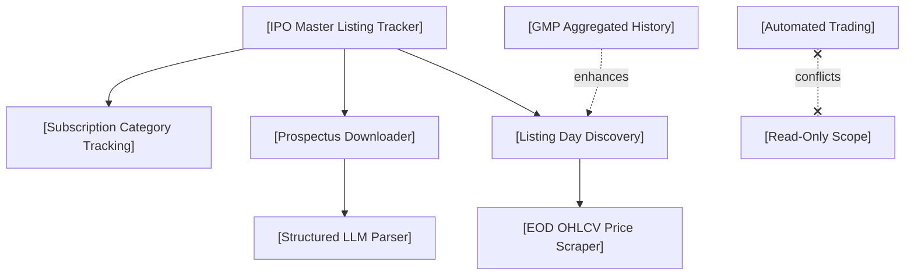

# Feature Research

**Domain:** IPO Scraper & Tracker (NSE/BSE India)
**Researched:** 2026-06-06
**Confidence:** HIGH

## Feature Landscape

### Table Stakes (Users Expect These)

Features users assume exist. Missing these = product feels incomplete.

| Feature | Why Expected | Complexity | Notes |
|---------|--------------|------------|-------|
| **Deduplicated Master IPO List** | Consolidated view of IPOs across sources (NSE-BSE SDK & Upstox API) without duplicates (by ISIN/Symbol). | MEDIUM | Deduplication must resolve spelling mismatches using Fuzzy Matching + ISIN keys. |
| **IPO Schedule & Dates** | Crucial timelines like Open, Close, Allotment, Refund, Shares Credit, and Listing Date. | LOW | Handled by scraping dates from exchange circulars and Upstox API data. |
| **Status State Machine** | Tracking IPO states (Upcoming, Open, Closed, Listed). | LOW | Transition states are standard. Needs mapping between Upstox statuses and NSE circulars. |
| **Pricing & Lot Sizes** | Showing Price Band (Floor vs Cap Price) and minimum retail lot sizes for application. | LOW | Standard fields present in NSE API and Upstox API. |
| **Prospectus PDF Downloads** | Direct links or downloads for DRHP, RHP, and Final Prospectus documents. | MEDIUM | Standard URLs retrieved from SEBI, NSE, or BSE websites. |
| **Post-Listing Daily OHLCV** | Daily candles (Open, High, Low, Close, Volume) of listed companies. | LOW | Feasible via NSE/BSE Bhavcopy files or Upstox historical price API. |

### Differentiators (Competitive Advantage)

Features that set the product apart. Not required, but valuable.

| Feature | Value Proposition | Complexity | Notes |
|---------|-------------------|------------|-------|
| **Structured PDF Ratio Parsing** | Converts target pages (e.g., basis of issue price, financials) of RHP to Markdown and parses ratios (P/E, RoNW, EPS) via LLM. | HIGH | R2 Staging -> OCR/Markdown -> DeepSeek API to extract clean JSON schemas. Saves enormous manual reading time. |
| **Daily GMP History Aggregation** | Track daily Grey Market Premium trends, Kostak rates, and Subject to Sauda rates. | MEDIUM | Scrapes unofficial forums/portals like InvestorGain, compiling historical trend charts. |
| **Listing Day Pop Predictor** | Estimate listing day opening price (`Issue Price + GMP`) and percentage gain. | MEDIUM | Uses subscription demand curves (QIB/NII/Retail) + GMP trends to forecast opening pricing. |
| **Category-wise Subscription Tracking** | Real-time / hourly updates of subscription multiples across QIB, NII, and Retail segments. | MEDIUM | Scraped from NSE/BSE bidding screens to show institutional interest. |
| **Mainboard vs. SME Categorization** | Clearly distinguishing SME IPOs (high risk, ₹1L+ lot size) from Mainboard IPOs (₹15k lot size). | LOW | Adds distinct UI highlights, warning tags, and separate tracking channels. |

### Anti-Features (Commonly Requested, Often Problematic)

Features that seem good but create problems.

| Feature | Why Requested | Why Problematic | Alternative |
|---------|---------------|-----------------|-------------|
| **Direct Grey Market Trading** | Users want to buy/sell IPO shares on grey market. | Unregulated, highly speculative, and illegal under SEBI guidelines. Huge counterparty risk. | Provide pure sentiment indices and GMP trackers for informational purposes only. |
| **Tick-by-Tick Price Storage** | Real-time tick data for listed stocks. | Enormous database bloat and API cost. Unnecessary for an IPO tracker app. | Standard daily OHLCV candles, with 1-minute resolution limited to the first 5 trading days post-listing. |
| **Automated ASBA/UPI Bidding** | Direct subscription bidding from the app. | Requires broker/ASBA gateway integration, SEBI intermediary registration, and liability for failed bids. | Provide deep linking to major brokers (Zerodha, Groww, Upstox) or UPI-mandate references with pre-filled fields. |

## Feature Dependencies

### Dependency Notes

- **[Structured LLM Parser] requires [Prospectus Downloader]:** RHP/DRHP PDFs must be fetched and cached locally before we can run page-range extraction, Markdown conversion, and LLM processing.
- **[EOD OHLCV Price Scraper] requires [Listing Day Discovery]:** We must know the official Listing Date and Symbol/Series from the Listing circular before we can correctly fetch post-listing price candles from Upstox or NSE Bhavcopy.
- **[GMP Aggregated History] enhances [Listing Day Discovery]:** Knowing the final GMP trend helps estimate listing day performance before the pre-open trading starts.
- **[Automated Trading] conflicts with [Read-Only Scope]:** Direct trading integration violates the project's read-only and scraper-focused architectural design.

## MVP Definition

### Launch With (v1)

Minimum viable product — what's needed to validate the concept.

- [ ] **Master IPO List consolidation** — Deduplicated database merging Upstox API and NSE-BSE SDK lists, supporting Mainboard and SME.
- [ ] **Date & Status State Machine** — Live state tracking (Upcoming, Open, Closed, Listed) based on bidding start/end and listing dates.
- [ ] **Prospectus PDF Downloader** — Script to fetch DRHP, RHP, and Final Prospectus PDFs from SEBI/exchange links and cache them.
- [ ] **InvestorGain GMP Crawler** — Simple scraper to collect daily GMP, listing estimate, and total subscription level.
- [ ] **Post-Listing Daily OHLCV Scraper** — Append standard daily price candles from Upstox API for listed IPOs.

### Add After Validation (v1.x)

Features to add once core is working.

- [ ] **Cloudflare R2 PDF Staging** — Automated upload of prospectus files and extracted markdown pages to R2.
- [ ] **DeepSeek LLM Prospectus Parser** — Automated ratio and financial data extraction from target pages of the prospectus.
- [ ] **Live Subscription Scraper** — Category-wise bidding multiples updated hourly during the subscription period.

### Future Consideration (v2+)

Features to defer until product-market fit is established.

- [ ] **Web Dashboard UI** — Transition from CLI/JSON files to a frontend dashboard.
- [ ] **Listing Day Real-Time Tracker** — Tracking pre-open discovery session (9:00 AM - 9:45 AM) on listing day.

## Feature Prioritization Matrix

| Feature | User Value | Implementation Cost | Priority |
|---------|------------|---------------------|----------|
| **Deduplicated Master IPO List** | HIGH | MEDIUM | P1 |
| **Prospectus PDF Downloader** | HIGH | MEDIUM | P1 |
| **InvestorGain GMP Crawler** | HIGH | MEDIUM | P1 |
| **Post-Listing Daily OHLCV** | MEDIUM | LOW | P1 |
| **Cloudflare R2 Staging** | MEDIUM | LOW | P2 |
| **DeepSeek Financial Parser** | HIGH | HIGH | P2 |
| **Category Subscription Scraper** | HIGH | MEDIUM | P2 |
| **Alert & Notification System** | MEDIUM | MEDIUM | P3 |
| **Web Dashboard UI** | HIGH | HIGH | P3 |

**Priority key:**
- P1: Must have for launch
- P2: Should have, add when possible
- P3: Nice to have, future consideration

## Competitor Feature Analysis

| Feature | Chittorgarh | Trendlyne | Our Approach |
|---------|-------------|-----------|--------------|
| **Master IPO List** | Manual entry, can be slow for small SMEs. | Good list, mostly mainboard. | Programmatic merge of NSE-BSE and Upstox with real-time updates. |
| **GMP Tracking** | Relies on forum comments / admin updates. | Not natively tracked. | Automated daily crawlers summarizing GMP histories and averages. |
| **Prospectus Information** | Standard PDF links. | PDF links, manual financial data summary. | Automated LLM-based parsing of exact target sections (ratios, objectives). |
| **Post-Listing Trading Data** | Basic current price (CMP) indicators. | Full charting but disconnected from IPO specs. | Consolidated timeline connecting prospectus, GMP, and post-listing OHLCV performance. |

## Sources

- **SEBI ICDR Regulations**: Guidelines detailing Draft Red Herring Prospectus (DRHP), Red Herring Prospectus (RHP), and Final Prospectus requirements.
- **NSE India IPO Section**: Rules around bidding hours, category-wise subscription multiples, and Bhavcopy structure.
- **Upstox API v2 documentation**: Core JSON structures for active and historical IPO lists.
- **InvestorGain Portal**: Live GMP metrics, day-wise GMP trends, and Kostak/Subject to Sauda rate tracking structures.
